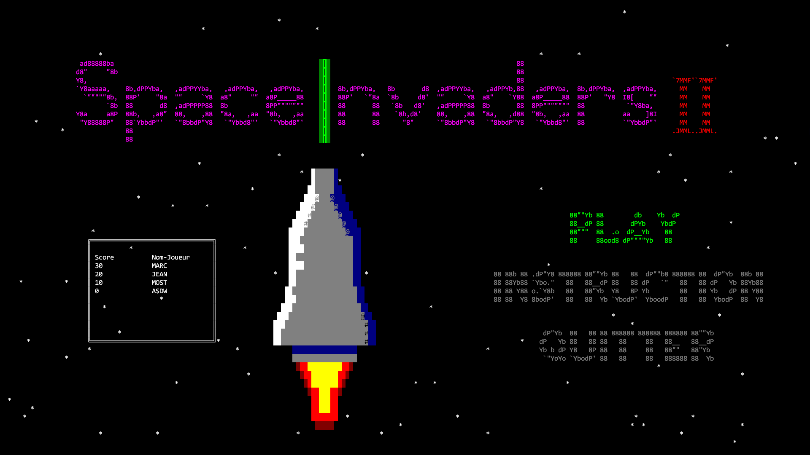
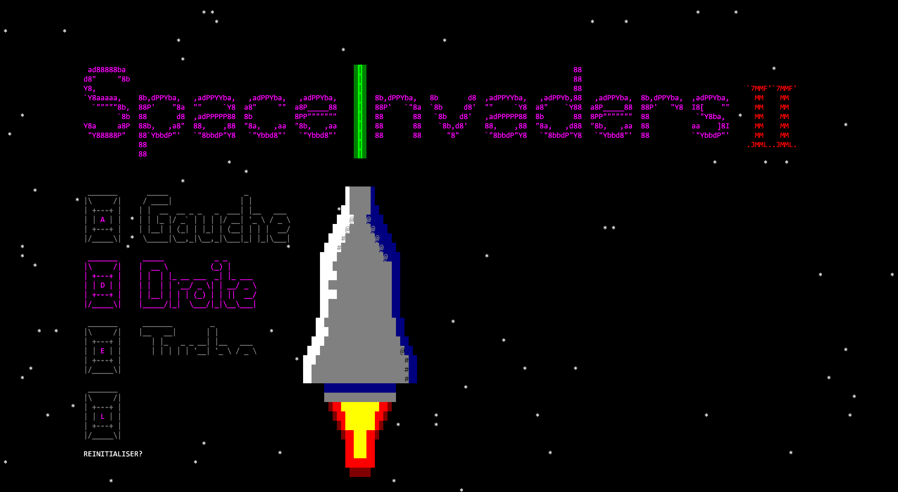
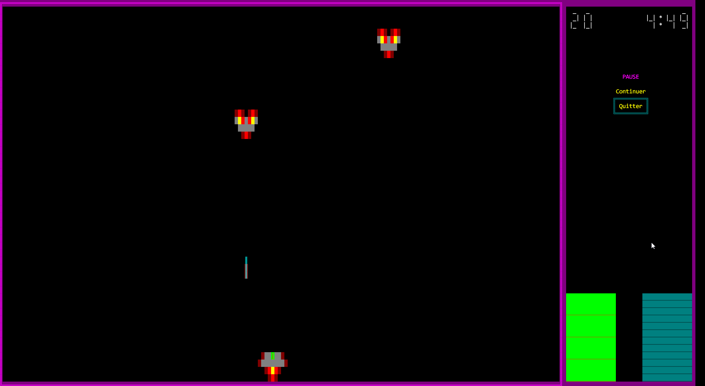
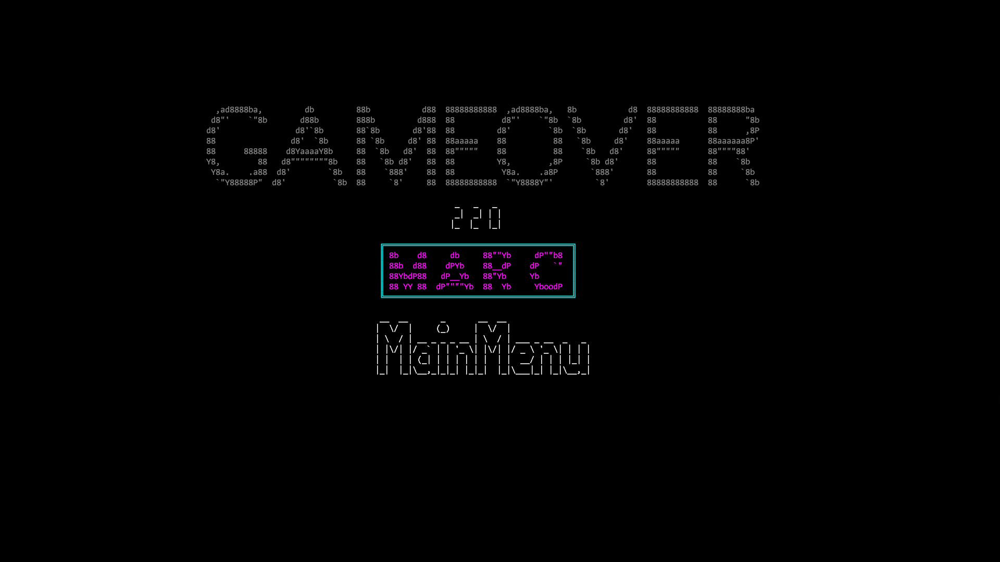
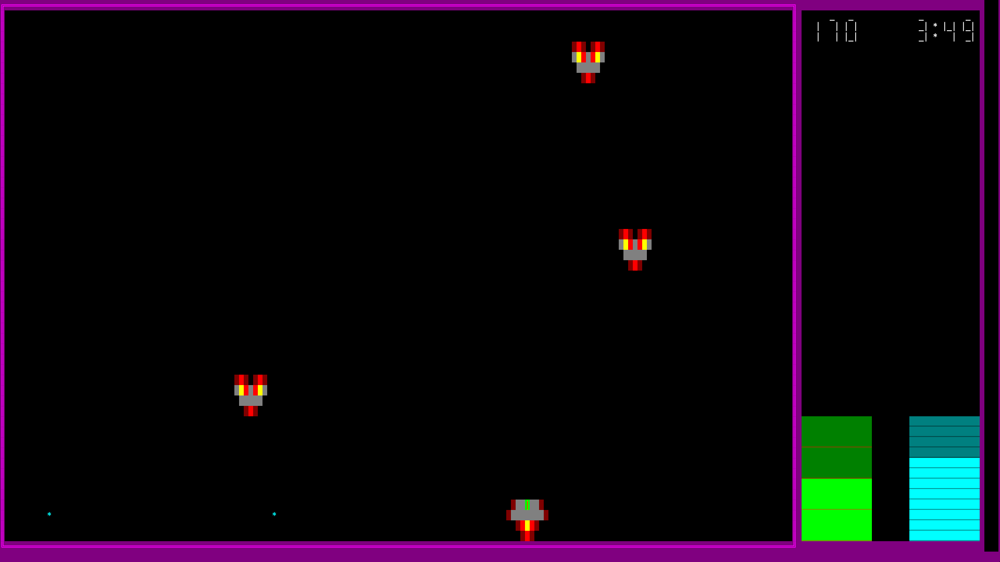
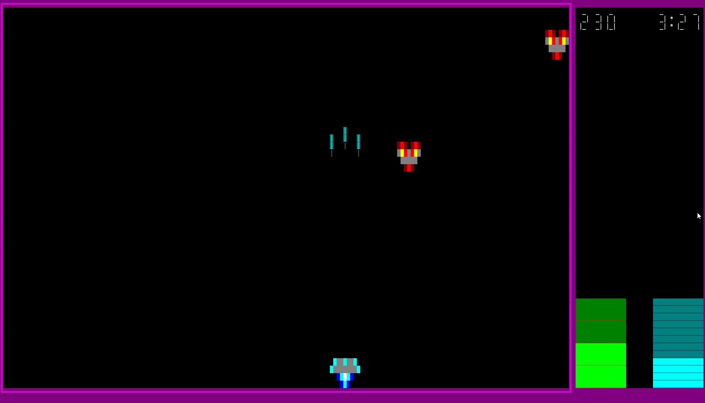

# Space-Invader
Projet réalisé dans le cours C++ à l'école Institut Supérieur d'Informatique (ISI).

Le fameux jeu Space Invader réalisé entièrement dans la console Windows. Premier projet orienté objet. Projet en équipe (2 personnes) et premier projet orienté objet. Malgré que le jeu soit en console, il est tout de même plein écran et contient des bandes audios.

Exemple de configuration de touche. Le joueur ne peut changer une touche pour une déjà utilisée. Une fois la touche changée, le joueur peut aussi reinitialiser les touches par défauts (ADEL)

Après la phase de selection du niveau de difficulté, le joueur est lancé dans la partie. Il peut tirer, se déplacer, mettre le jeu en pause (touche P par defaut) et ramasser des bonus de vie et de l'énergie.

Si le joueur gagne s'il survit pendant tout le décompte (5 minutes). Dans tous les cas, il est envoyé au menu pour enregistrer son nom dans le ScoreBoard.

D'autre image du jeu avec les pouvoirs et les boules d'énergie au sol.

