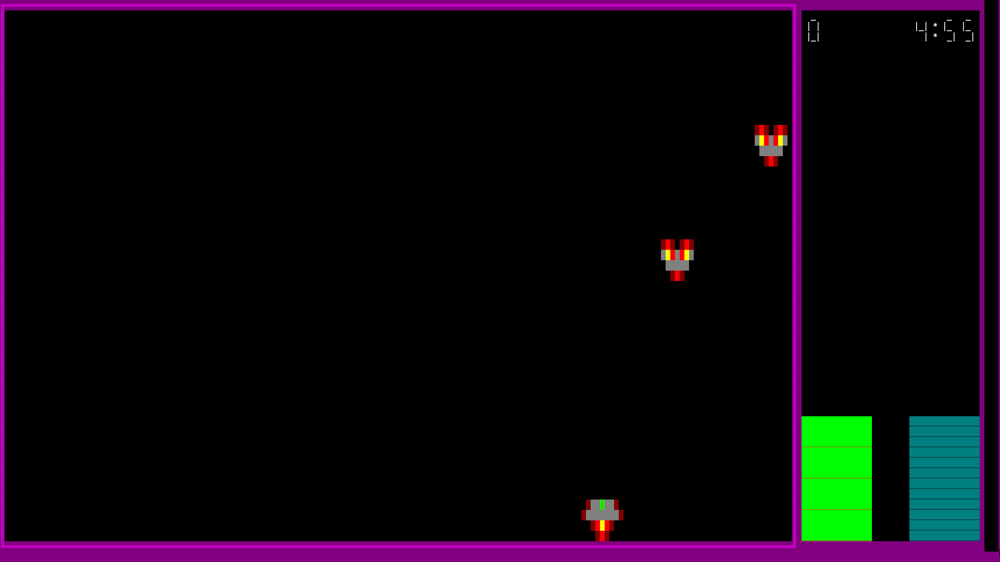

# Space-Invader
Projet réalisé dans le cours C++, 

Exemple de configuration de touche. Le joueur ne peut pas changer une touche pour une déjà utilisée. Une fois la touche changée, le joueur peut aussi reinitialiser les touches par défauts.
